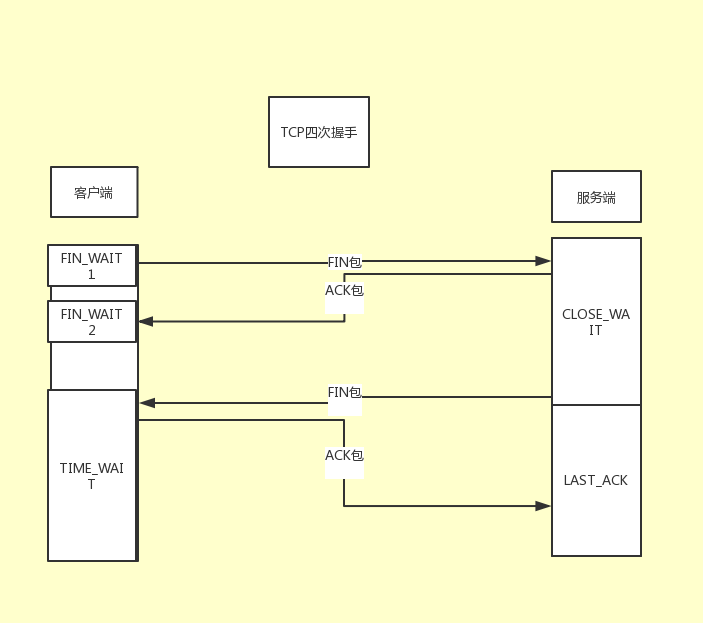

# TCP四次握手

#### 介绍

## 握手流程

由于TCP连接是全双工的,因此每个方向都必须单独进行关闭.这个原则是当一方
完成它的数据发送任务后就能发送一个FIN来终止这个方向的连接.收到一个FIN只
意味着这一方向上没有数据流动,一个TCP连接在接收到一个FIN后仍能发送数据.首先
进行关闭的一方将执行主动关闭,而另一方执行被动关闭.

1.客户端发送一个FIN包,用来关闭客户端到服务器的数据传送.客户端进入FIN_WAIT1状态.
2.服务器收到这个FIN包,发送一个ACK包给客户端.服务端进入CLOSE_WAIT状态.
3.服务器发送一个FIN给客户端,用来关闭服务器与客户端的数据传送,服务器进入LAST_ACK状态.
4.客户端收到FIN后,进入TIME_WAIT状态,接着发送一个ACK给服务端.最后客户端和服务端都进入
CLOSED状态.

### 为什么建立连接协议是三次握手,而关闭连接这是四次握手呢?

因为服务端的LISTEN状态下的SOCKET当收到SYN包的建立连接后,它可以把ACK和SYN(ACK起应答作用,
而SYN起同步作用)放在一个报文里来发送,但关闭连接时,当收到对方的FIN报文通知时,它仅仅表示对方
没有数据发送给你了;但未必你所有的数据都全部发送给对方了,所以你可以未必会马上会关闭SOCKET,
也许你可能还需要发送一些数据给对方之后,再发送FIN报文给对方来表示你同意现在可以关闭连接了,
所以它这里的ACK报文和FIN报文多数情况下都是分开发送的.

### 为什么TIME_WAIT状态还需要等2MSL后才能返回到CLOSED状态?

因为双方都同意关闭连接了,而且握手的4个报文也都协调好发送完毕,按理可以直接回到CLOSED状态(就好比
SYN_SEND状态到ESTABLISH状态那样);但是因为我们必须要假想网络是不可靠的,你无法保证你最后发送的
ACK报文会一定被对方收到,因此对方处于LAST_ACK状态下的SOCKET可能会因为超时未收到ACK报文,而重发FIN
报文,所以这个TIME_WAIT状态的作用就是用来重发可能丢失的ACK报文.经过2MSL的时间服务端没有回复,那么可以确认
连接已经正常关闭了,那么客户端也可以关闭连接了.

### 为什么会产生CLOSE_WAIT?

1.在swoole里onClose回调函数里,阻塞了程序比如(sleep(1000))或者死循环.
2.或者在swoole里执行die函数.或者exit函数

