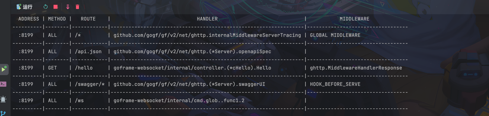
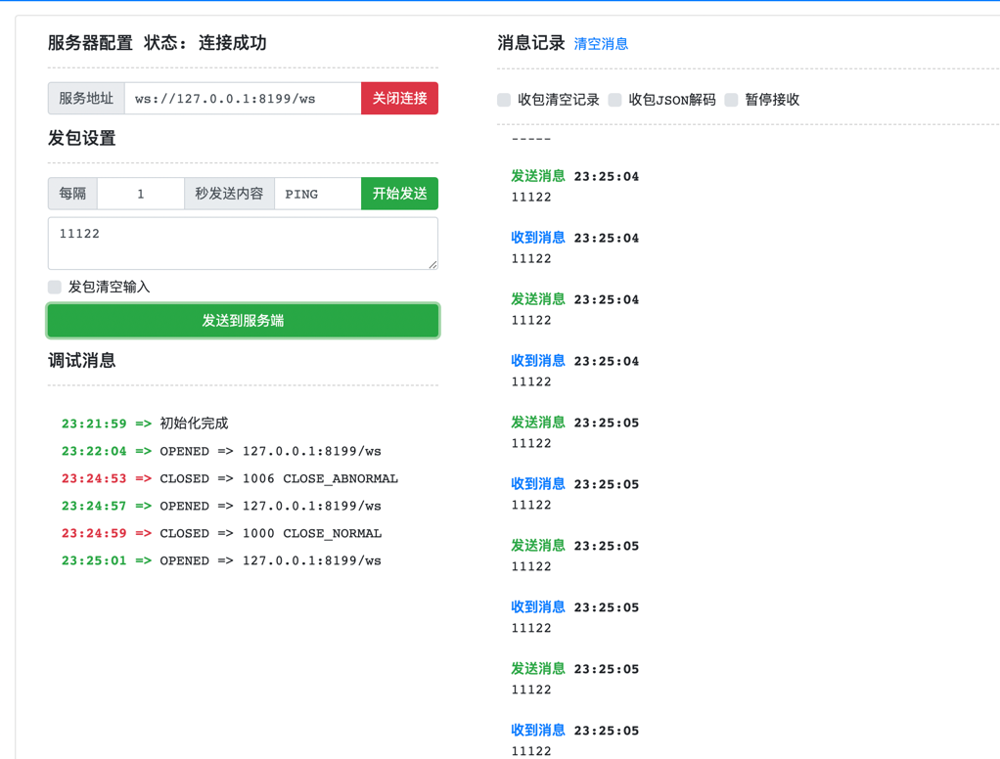

## 安装wget
````shell

brew install wget
````

# 安装goframe二进制文件

````bash
wget -O gf https://github.com/gogf/gf/releases/latest/download/gf_$(go env GOOS)_$(go env GOARCH) && chmod +x gf && ./gf install -y && rm ./gf
````

# 查看goframe

```shell
gf -v

GoFrame CLI Tool v2.2.0-beta2, https://goframe.org
GoFrame Version: cannot find go.mod
CLI Installed At: /opt/homebrew/opt/openssl@3/bin/gf
CLI Built Detail:
  Go Version:  go1.17.13
  GF Version:  v2.2.0-beta2
  Git Commit:  2022-09-30 15:42:57 007715dbd5dd949c10727c6e84abcd932ac4937f
  Build Time:  2022-09-30 15:44:39
```

# 搭建Http服务

```go
package cmd

import (
	"context"

	"github.com/gogf/gf/v2/frame/g"
	"github.com/gogf/gf/v2/net/ghttp"
	"github.com/gogf/gf/v2/os/gcmd"
	"github.com/gogf/gf/v2/os/gfile"
	"github.com/gogf/gf/v2/os/glog"

	"goframe-websocket/internal/controller"
)

var (
	Main = gcmd.Command{
		Name:  "main",
		Usage: "main",
		Brief: "start http server",
		Func: func(ctx context.Context, parser *gcmd.Parser) (err error) {
			s := g.Server()
			s.Group("/", func(group *ghttp.RouterGroup) {
				group.Middleware(ghttp.MiddlewareHandlerResponse)
				group.Bind(
					controller.Hello,
				)
			})
			s.BindHandler("/ws", func(r *ghttp.Request) {
				var ctx = r.Context()
				ws, err := r.WebSocket()
				if err != nil {
					glog.Error(ctx, err)
					r.Exit()
				}
				for {
					msgType, msg, err := ws.ReadMessage()
					if err != nil {
						return
					}
					if err = ws.WriteMessage(msgType, msg); err != nil {
						return
					}
				}
			})
			s.SetServerRoot(gfile.MainPkgPath())
			s.SetPort(8199)
			s.Run()
			return nil
		},
	}
)

```

