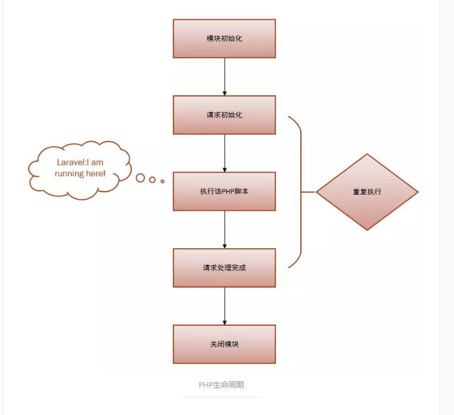

## 优点
开发高效,生态丰富.语法优雅,遇见问题容易搜出答案.

## 生命周期

## laravel生命周期
入口文件index.php
1.注册加载composer自动生成的class loader
加载第三方依赖
2.生成容器container
并向容器注册核心组件,是从bootstrap/app.php脚本获取laravel应用实例.
3.处理请求,并生成发送响应.
请求被发送到HTTP内核或Console内核.Http内核的标志性方法handle处理的逻辑相当简单,获取Request实例,
返回一个Response,把内核想象作为一个应用的盒子.输入HTTP请求,返回HTTP响应.
   1.首先Bootstrap检测环境,加载bootstrapper数组中的一些配置.
   配置包括错误处理,日志,检测应用环境以及其他在请求被处理前需要执行的任务.
   2.第一堵墙,全局中间件,默认为CheckForMaintenanceMode
   在Laravel基础的服务启动之后,就要把请求传递给路由了.路由器将会分发请求到路由或控制器,同时运行所有
   路由指定的中间件.
   3.然后遍历所有注册的路由,找到最先符合的一个路由
   4.第二堵墙,通过该路由的中间件
    经过该路由中间件,进入到控制器或者闭包函数,执行你的具体逻辑代码
   