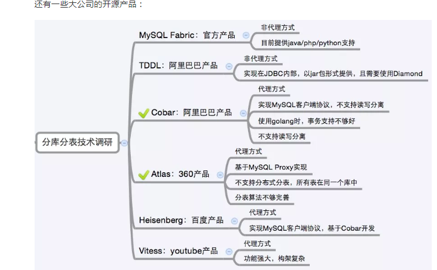

## 单库太大
单个数据库处理能力有限；单库所在服务器上磁盘空间不足；单库上操作的IO瓶颈 解决方法：切分成更多更小的库
## 单表太大
CRUD都成问题；索引膨胀，查询超时 解决方法：切分成多个数据集更小的表。
## 分库分表
一般就是垂直切分和水平切分，这是一种结果集描述的切分方式，是物理空间上的切分。 我们从面临的问题，开始解决，阐述： 首先是用户请求量太大，我们就堆机器搞定（这不是本文重点）。
然后是单个库太大，这时我们要看是因为表多而导致数据多，还是因为单张表里面的数据多。 如果是因为表多而数据多，使用垂直切分，根据业务切分成不同的库。
如果是因为单张表的数据量太大，这时要用水平切分，即把表的数据按某种规则切分成多张表，甚至多个库上的多张表。 分库分表的顺序应该是先垂直分，后水平分。 因为垂直分更简单，更符合我们处理现实世界问题的方式

## 垂直拆分
1.垂直分表
  也就是“大表拆小表”，基于列字段进行的。一般是表中的字段较多，将不常用的， 数据较大，长度较长（比如text类型字段）的拆分到“扩展表“。 一般是针对那种几百列的大表，也避免查询时，数据量太大造成的“跨页”问题。
2.垂直分库
   垂直分库针对的是一个系统中的不同业务进行拆分，比如用户User一个库，商品Producet一个库，订单Order一个库。 切分后，要放在多个服务器上，而不是一个服务器上。为什么？ 我们想象一下，一个购物网站对外提供服务，会有用户，商品，订单等的CRUD。没拆分之前， 全部都是落到单一的库上的，这会让数据库的单库处理能力成为瓶颈。按垂直分库后，如果还是放在一个数据库服务器上， 随着用户量增大，这会让单个数据库的处理能力成为瓶颈，还有单个服务器的磁盘空间，内存，tps等非常吃紧。 所以我们要拆分到多个服务器上，这样上面的问题都解决了，以后也不会面对单机资源问题。
   
   数据库业务层面的拆分，和服务的“治理”，“降级”机制类似，也能对不同业务的数据分别的进行管理，维护，监控，扩展等。 数据库往往最容易成为应用系统的瓶颈，而数据库本身属于“有状态”的，相对于Web和应用服务器来讲，是比较难实现“横向扩展”的。 数据库的连接资源比较宝贵且单机处理能力也有限，在高并发场景下，垂直分库一定程度上能够突破IO、连接数及单机硬件资源的瓶颈。
## 水平拆分
1.水平分表
  针对数据量巨大的单张表（比如订单表），按照某种规则（RANGE,HASH取模等），切分到多张表里面去。 但是这些表还是在同一个库中，所以库级别的数据库操作还是有IO瓶颈。不建议采用。
2.水平分库分表
  将单张表的数据切分到多个服务器上去，每个服务器具有相应的库与表，只是表中数据集合不同。 水平分库分表能够有效的缓解单机和单库的性能瓶颈和压力，突破IO、连接数、硬件资源等的瓶颈
3.水平分库分表切分规则
  a. RANGE
  从0到10000一个表，10001到20000一个表；
  b. HASH取模
  一个商场系统，一般都是将用户，订单作为主表，然后将和它们相关的作为附表，这样不会造成跨库事务之类的问题。 取用户id，然后hash取模，分配到不同的数据库上。
  c. 地理区域
  比如按照华东，华南，华北这样来区分业务，七牛云应该就是如此。
  d. 时间
  按照时间切分，就是将6个月前，甚至一年前的数据切出去放到另外的一张表，因为随着时间流逝，这些表的数据 被查询的概率变小，所以没必要和“热数据”放在一起，这个也是“冷热数据分离”。
 ## 分库分表后面临的问题
 ### 事务支持
  分库分表后，就成了分布式事务了。如果依赖数据库本身的分布式事务管理功能去执行事务，将付出高昂的性能代价； 如果由应用程序去协助控制，形成程序逻辑上的事务，又会造成编程方面的负担。
 ## 多库结果集合并（group by，order by）
  TODO
  跨库join
  TODO 分库分表后表之间的关联操作将受到限制，我们无法join位于不同分库的表，也无法join分表粒度不同的表， 结果原本一次查询能够完成的业务，可能需要多次查询才能完成。 粗略的解决方法： 全局表：基础数据，所有库都拷贝一份。 字段冗余：这样有些字段就不用join去查询了。 系统层组装：分别查询出所有，然后组装起来，较复杂。
 ## 分库分表方案产品
  目前市面上的分库分表中间件相对较多，其中基于代理方式的有MySQL Proxy和Amoeba， 基于Hibernate框架的是Hibernate Shards，基于jdbc的有当当sharding-jdbc， 基于mybatis的类似maven插件式的有蘑菇街的蘑菇街TSharding， 通过重写spring的ibatis template类的Cobar Client。
  
  还有一些大公司的开源产品：
  