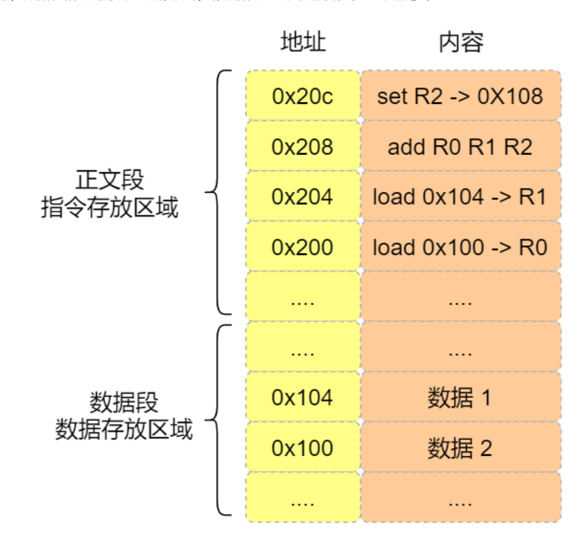

# 一、硬件结构

## 1.1 CPU是如何执行程序的？

### 图灵机的工作方式

 
通过图灵机计算1+2的过程，可以发现图灵机主要功能就是读取纸带格子中的内容，然后交给控制单元识别字符是数字还是运算符指令，如果是数字则存入到图灵机状态中，如果是运算符，则通知运算符单元读取状态中的数值进行计算，计算结果最终返回给读写头，计算结果最终返回给读写头,读写头把结果写入到纸带的格子中

### 冯诺依曼模型

计算机组成部分,分别是中央处理器(CPU)、内存、输入设备、总线.

1. 内存
```
数据存储的单位是一个二进制位(bit),即0和1,最小的存储单位是字节(byte),1字节等于8位.
```

2.中央处理器
````
CPU，32位和64位CPU主要区别在于一次能计算多少字节数据:
32位CPU一次可以计算4个字节;
64位CPU一次可以计算8个字节
CPU内部还有一些组件,常见的有寄存器,控制单元和逻辑运算单元等，其中控制单元负责控制CPU工作，逻辑运算单元负责计算，而寄存器可以分为多种类，每种寄存器的功能不同.
常见的寄存器种类:
通用寄存器,用来存放需要进行运算的数据,比如需要进行加和运算的两个数据.
程序计数器:用来存储CPU要执行下一条指令「所在的内存地址」,注意不是存储了下一条要执行的指令,此时指令还在内存中,程序计数器只是存储了下一条指令的地址.
指令寄存器:用来存放程序计数器指向的指令,指令被执行完成之前，指令都存储在这里
````
3.总线
```
总线是用于CPU和内存以及其他设备之间的通信,总线可分为3种
地址总线:用于指定CPU将要操作的内存地址
数据总线:用于读写内存的数据
控制总线:用于发送和接收信号,比如中断、设备复位等信号,CPU收到信号后自然进行响应,这时也需要控制总线.
当CPU要读写内存数据的时候,一般需要通过两个总线
首先要通过「地址总线」来指定内存的地址
再通过「数据总线」来传输数据

```
4.输入、输出设备
```
输入设备向计算机输入数据,计算机经过计算后,把数据输出给输出设备.期间,如果输入设备是键盘,按下按键是需要和CPU进行交互的，这时就需要用到控制总线了.
```
5.线路位宽与CPU位宽
```
数据是如何通过线路传输的呢？其实是通过操作电压,低电压表示0，高压电压则表示1
如果构造了高低高这样的信号，其实就是101二进制数据，十进制则表示5，如果只有一条线路,就意味着每次只能传递1bit的数据,即0或1，那么传输101这个数据，就需要3次才能传输完成，这样的效率非常低。这样一位一位传输的方式，称为串行，下一个bit必须等待上一个bit传输完成才能进行传输，当然，想多次多传一些数据,增加线路即可，这时候数据就可以并行传输.

为了避免低效率的串⾏传输的⽅式，线路的位宽最好⼀次就能访问到所有的内存地址。 CPU 要想操作的内
存地址就需要地址总线，如果地址总线只有 1 条，那每次只能表示 「0 或 1」这两种情况，所以 CPU ⼀次
只能操作 2 个内存地址，如果想要 CPU 操作 4G 的内存，那么就需要 32 条地址总线，因为 2 ^ 32 = 4G 。

知道了线路位宽的意义后，我们再来看看 CPU 位宽。
CPU 的位宽最好不要⼩于线路位宽，⽐如 32 位 CPU 控制 40 位宽的地址总线和数据总线的话，⼯作起来
就会⾮常复杂且麻烦，所以 32 位的 CPU 最好和 32 位宽的线路搭配，因为 32 位 CPU ⼀次最多只能操作
32 位宽的地址总线和数据总线。
如果⽤ 32 位 CPU 去加和两个 64 位⼤⼩的数字，就需要把这 2 个 64 位的数字分成 2 个低位 32 位数字和
2 个⾼位 32 位数字来计算，先加个两个低位的 32 位数字，算出进位，然后加和两个⾼位的 32 位数字，
最后再加上进位，就能算出结果了，可以发现 32 位 CPU 并不能⼀次性计算出加和两个 64 位数字的结
果。
对于 64 位 CPU 就可以⼀次性算出加和两个 64 位数字的结果，因为 64 位 CPU 可以⼀次读⼊ 64 位的数
字，并且 64 位 CPU 内部的逻辑运算单元也⽀持 64 位数字的计算。
但是并不代表 64 位 CPU 性能⽐ 32 位 CPU ⾼很多，很少应⽤需要算超过 32 位的数字，所以如果计算的
数额不超过 32 位数字的情况下，32 位和 64 位 CPU 之间没什么区别的，只有当计算超过 32 位数字的情
况下，64 位的优势才能体现出来。
另外，32 位 CPU 最⼤只能操作 4GB 内存，就算你装了 8 GB 内存条，也没⽤。⽽ 64 位 CPU 寻址范围
则很⼤，理论最⼤的寻址空间为 2^64 。
```

### 程序的执行过程
```
程序实际上是一条一条指令，所以程序的运行过程就是把每一条指令一步一步的执行起来，负责
执行命令的就是CPU了.

CPU执行程序的过程如下:
1.第一步,CPU读取「程序计数器」的值,这个值是指令的内存地址,然后CPU的「控制单元」
操作「地址总线」指定需要访问的内存地址,接着通知内存设备准备数据,数据准备好后通过「数据总线」
将指令数据传给CPU,CPU收到内存传来的数据后，将这个指令数据存入到「指令寄存器」

2.第二步,CPU分析「指令寄存器」中的指令，确定指令的类型和参数,如果是计算类型的指令,就把指令交给「逻辑运算单元」运算;如果是存储类型的指令,则交由「控制单元」执行.

3.第三步，CPU执行完指令后，「程序计数器」的值自增,表示指向下一条指令.这个自增的大小,由CPU
的位宽决定,比如32位的CPU，指令是4个字节,需要四个内存地址存放,因此「程序计数器」的值会自4.

简单总结一下就是，一个程序执行的时候,CPU会根据程序计数器里的内存地址,从内存里面把需要执行的指令读取到指令寄存器里面执行，然后根据指令长度自增,开始顺序读取下一条指令。

CPU从程序计数器读取指令、到执行、再到下一条指令,这个过程会不断循环,直到程序结束执行,这个执行不断循环的过程被称为CPU的指令周期。

```
### a=1+2执行具体过程

```
知道了基本的程序执行过程后,接下来用a=1+2的作为例子,进一步分析该过程再冯诺依曼模型的执行过程

CPU是不认识a=1+2这个字符串,这些字符串只是方便我们程序认识,要想这段程序能跑起来,还需要把证个程序翻译成汇编语言的程序,这个过程称位编译成汇编代码.

针对汇编代码,我们还需要用汇编器翻译成机器玛,这些机器码由0和1组成的机器语言,这一条条机器语码，就是一条条的计算机指令,这个才是CPU能够真正认识的东西.

下面来看看a=1+2在32位CPU的执行过程.

程序编译过程中，编译器通过分析代码,发现1和2是数据，于是程序运行时，内存会有个专门的区域来存放这些数据,这个区域就是「数据段」。如下图,数据1和2的区域位置:

  数据1被存放到0x100位置
  数据2被存放到0x104的位置
  
注意，数据和指令是分开区域存放的，存放指令区域的地⽅称为「正⽂段」。 
 
```

```
编译器会把 a = 1 + 2 翻译成 4 条指令，存放到正⽂段中。如图，这 4 条指令被存放到了 0x200 ~ 0x20c
的区域中：
0x200 的内容是 load 指令将 0x100 地址中的数据 1 装⼊到寄存器 R0 ；
0x204 的内容是 load 指令将 0x104 地址中的数据 2 装⼊到寄存器 R1 ；
0x208 的内容是 add 指令将寄存器 R0 和 R1 的数据相加，并把结果存放到寄存器 R2 ；
0x20c 的内容是 store 指令将寄存器 R2 中的数据存回数据段中的 0x108 地址中，这个地址也就
是变量 a 内存中的地址；
编译完成后，具体执⾏程序的时候，程序计数器会被设置为 0x200 地址，然后依次执⾏这 4 条指令。
上⾯的例⼦中，由于是在 32 位 CPU 执⾏的，因此⼀条指令是占 32 位⼤⼩，所以你会发现每条指令间隔
4 个字节。
⽽数据的⼤⼩是根据你在程序中指定的变量类型，⽐如 int 类型的数据则占 4 个字节， char 类型的数
据则占 1 个字节。
```
